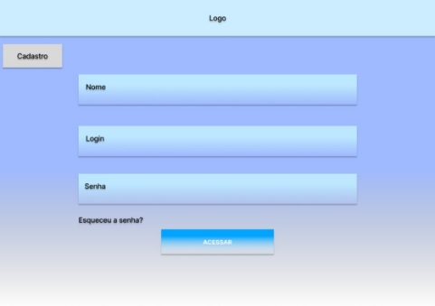
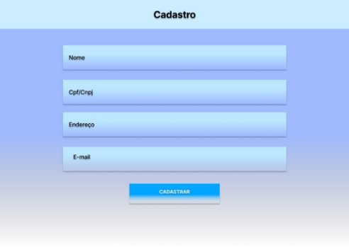
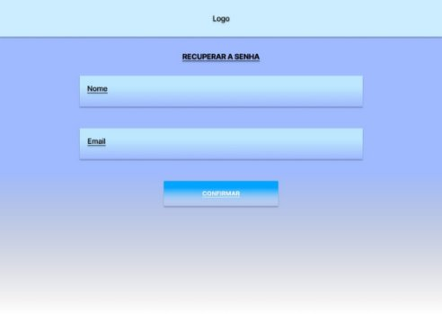
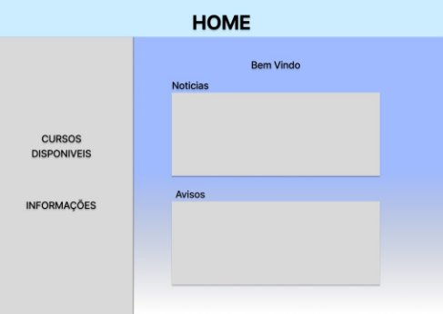
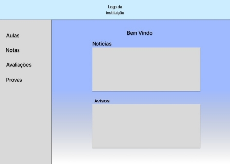
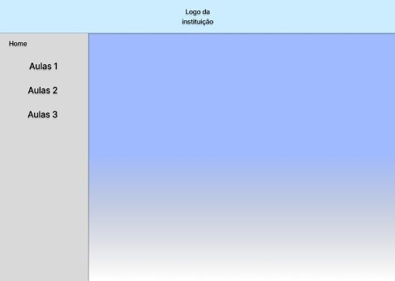
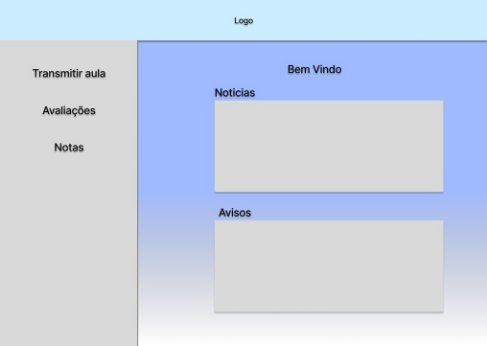
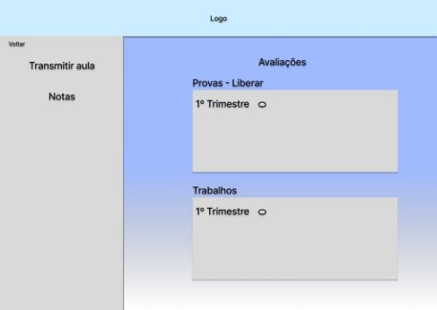
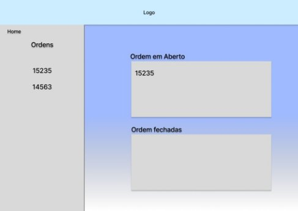

## **PROTOTIPO DO APLICATIVO**
A construção de um aplicativo passa por uma fase essencial conhecida como modelagem. Os modelos de aplicativos são representações visuais e interativas que possibilitam aos programadores e designers experimentar, validar e otimizar a usabilidade, funcionalidade e experiência do usuário antes de iniciar a codificação completa do aplicativo. Eles vão desde rascunhos básicos até representações detalhadas que simulam diversas interações e situações de uso.

A elaboração de modelos de aplicativos tem um papel vital no processo de desenvolvimento, possibilitando que os times trabalhem juntos de maneira eficaz e aperfeiçoem suas concepções até chegarem a um produto final de excelente qualidade.

Para assegurar uma experiência positiva para os usuários, é crucial empregar boas práticas de UX (Experiência do Usuário) no projeto. Isso envolve a criação de interfaces compreensíveis, de fácil manuseio e agradáveis, que satisfaçam as necessidades e expectativas dos usuários. Ao adotar essas práticas, é possível elevar a satisfação do usuário, aumentar a eficiência e a produtividade, diminuir erros e retrabalhos, obter vantagem competitiva e reforçar a imagem da marca.

## **PROTOTIPO**
As imagens abaixo mostram as telas do protótipo desenvolvido pela equipe na plataforma figma, usando um layout simples e de fácil entendimento.

||
| :- |
|

|
|

|
|

|

||
| :- |
|

	
|
|

|

||
| :- |
|

|

||
| :- |
|

|

|![ref1]|
| :- |
|

![ref2]
|

|![ref1]|
| :- |
|

![ref2]
|

### `     `**4. Referências**

Desenvolvimento de Aplicativos Móveis Multiplataforma - Universidade Tecnológica Federal do Paraná

Prototipação - Universidade Federal de Minas Gerais

[ref1]: Aspose.Words.6ef6fed8-93a9-47e8-a566-3893b9a8ef6d.014.jpeg
[ref2]: Aspose.Words.6ef6fed8-93a9-47e8-a566-3893b9a8ef6d.015.jpeg
